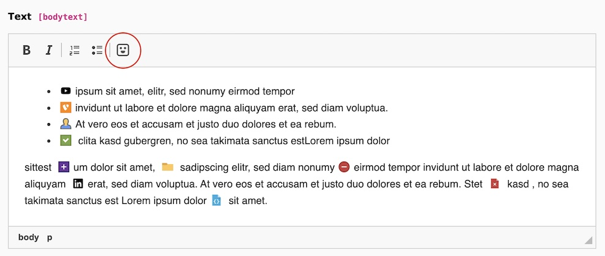

<div align="center">


# TYPO3 extension `bw_icons`

[](https://extensions.typo3.org/extension/bw_icons)

</div>

Icon picker for TCA and RTE. Generates a browsable gallery of your icon fonts
and SVGs - just link your stylesheet or image directory. Works with FontAwesome,
Bootstrap, Icomoon.. Optionally adds icon field to pages, tt_content or
sys_category.




## Demo


## Features

* icon picker form element
* icon field for tt_content, pages and sys_category
* RTE plugin
* icon gallery with filter function
* displays icons from image files or font (css)
* extracts and caches font styles (css)
* works with remote css files
* can include generated stylesheet in the frontend

Pro tip: Use your Icomoon development file. Your Icon Picker is always up to
date, and you can serve the font files from your own remote without manually
downloading and adjusting paths!

## Installation

1. Install via composer
``` {.bash}
composer require blueways/bw-icons
```

2. Update database schema

3. Include PageTS

Enable the extension in the Extension Manager and include the **static
PageTS** for TYPO3 core icons or set up your own icons. See *Configuration*
section.

4. Enable icons for tt_content, pages and/or sys_category

In the extension
settings (`Admin Tools → Extension Configuration → bw_icons`), you can enable
the icon fields. If you want to use it for other tables, see *For developers*
section.

5. Include RTE configuration (optional)
```yaml
imports:
    - { resource: EXT:bw_icons/Configuration/RTE/IconPicker.yaml }

editor:
    config:
        toolbar:
        - { name: 'icon', items: [IconPicker] }
```

## Configuration

The displayed icons are set up via PageTS. Choose a unique identifier and
select `FileIconProvider` if you want to add
image files from a directory or `CssIconProvider` if you want to display font
icons from a stylesheet.

```typo3_typoscript
mod.tx_bwicons {

    # Get icons from directory and subdirectory. Subdirectories become sidebar links.
    typo3icons = Blueways\BwIcons\Provider\FileIconProvider
    typo3icons {
        title = TYPO3 Icons
        folder = EXT:core/Resources/Public/Icons/T3Icons/svgs
    }

    # Get icons from stylesheet. Multiple font-faces in one file become sidebar links.
    fontawesome = Blueways\BwIcons\Provider\CssIconProvider
    fontawesome {
        title = FontAwsome
        file = fileadmin/fontawesome/css/all.css
    }

    # Get icons from remote stylesheet. Styles and font files are cached in /typo3temp
    icomoon = Blueways\BwIcons\Provider\CssIconProvider
    icomoon {
        title = Icomoon
        file = https://i.icomoon.io/public/b23ec64zea/Project/style.css
        # optional: adjust markup in backend wizard
        # defaults to <i class="###ICON###"></i>
        markup = <span class="my-custom-class ###ICON###"></span>
    }
}
```

After changing the settings, make sure to clear the cache.

### RTE Configuration

After importing the yaml configuration, you can add the new button anywhere you
want to your RTE
present. [Read more](https://docs.typo3.org/c/typo3/cms-rte-ckeditor/main/en-us/Configuration/)
about RTE configuration.

```yaml
imports:
    - { resource: EXT:bw_icons/Configuration/RTE/IconPicker.yaml }

editor:
    config:
        toolbar:
            items:
                - IconPicker
```

## Usage

The icons are saved as filename (
e.g. `EXT:myext/Resources/Public/Images/icon.svg` or `fileadmin/icons/foo.png`)
if you use the `FileIconProvider` or as css class names (
e.g. `fas fa-arrow-right`) by using `CssIconProvider`.

If you have configured only the selection of SVGs, you can safely use
the `<f:image src="{data.tx_bwicons_icon}" />` viewHelper in your fluid
template.

By only using font icons, you can output
like `<i class="{data.tx_bwicons_icon}"></i>`.

If you have a mixture, you can use my ViewHelper that determines the type by
checking for a dot in the icon name:

```html
{namespace bw=Blueways\BwIcons\ViewHelpers}

<bw:icon icon="{data.tx_bwicons_icon}" /> Hello world!
```

Output:

```html
<i class="fa fas-wave"></i> Hello world!
```

or

```html

 Hello world!
```

### CSS Frontend Include

If you want to include the extracted styles in the frontend, you can use
the `CssUtility` to generate the style-tags in the head of your page. Include
this in your **TypoScript setup**:

```typo3_typoscript
page.headerData {
    123 = USER
    123.userFunc = Blueways\BwIcons\Utility\CssUtility->includeStyleSheets
}
```

## For developers

### Usage in other tables

1. Create database field for the icon:
```sql
create table tx_myext_domain_model_foo (
    icon_field varchar(255) not null default '',
);
```

2. Edit TCA: Add the renderType `iconSelection` in the config array:
```php
...
'icon_field' => [
        'label' => 'My Icon',
        'config' => [
            'type' => 'input',
            'renderType' => 'iconSelection'
        ]
],
...
```

Optional: you may restrict which icon providers are available:
```php
...
'icon_field' => [
        'label' => 'My Icon',
        'config' => [
            'type' => 'input',
            'renderType' => 'iconSelection',
            'iconProviders' => 'fontawesome,otherProviderKey',
        ],
],
...
```

### New icon sources

If you want to add other icon sources (e.g. from API), you can create your own
IconProvider. Just make sure to extend
from `Blueways\BwIcons\Provider\AbstractIconProvider`.

## Contribute

This extension was made by Maik Schneider: Feel free to contribute!

* [Github-Repository](https://github.com/maikschneider/bw_icons)

Thanks to [blueways](https://www.blueways.de/) and [XIMA](https://www.xima.de/)!
